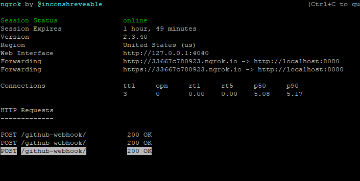
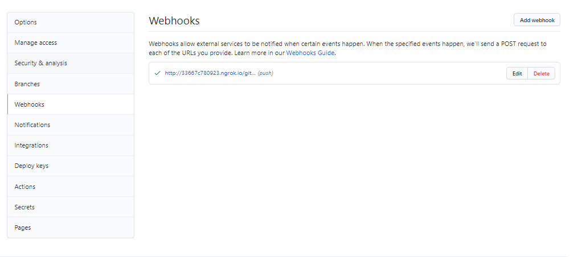
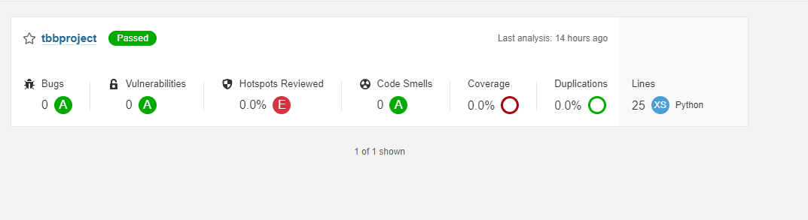
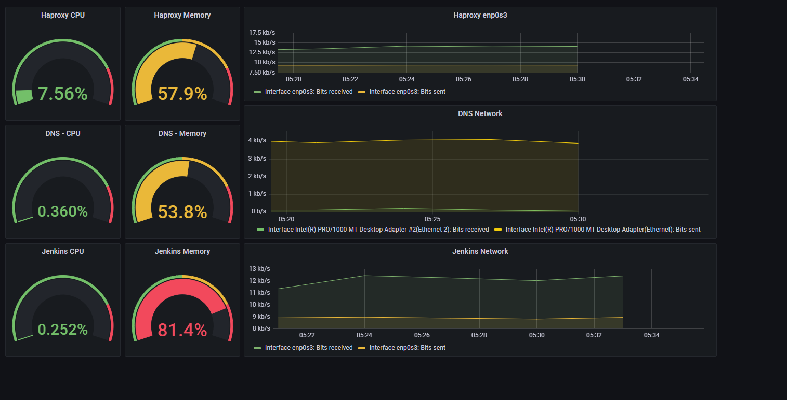
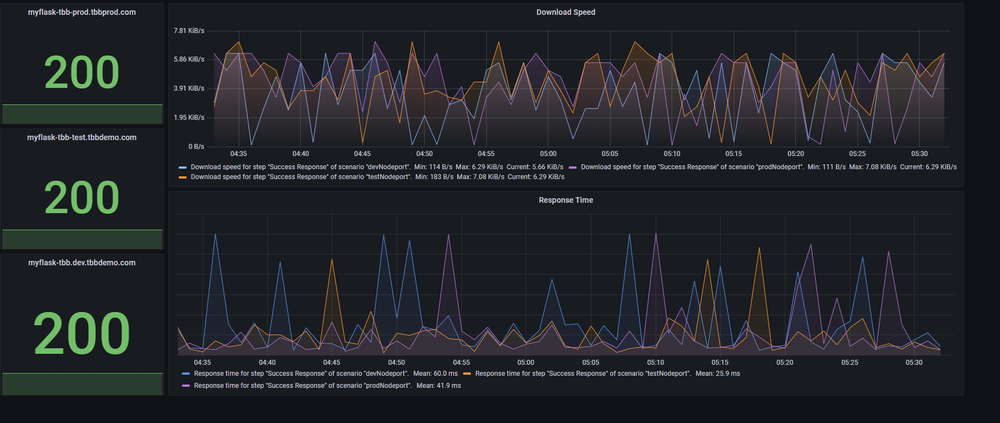

# TBB DevOps Uzmanı Yetiştirme Programı Bitirme Çalışması 

Bitirme projesinde bir Flask uygulaması önce dockerize edildi sonrasında kubernetes kullanılarak deploy edildi. CI/CD yönetimi Jenkins ile yapıldı. 

## Jenkins
Jenkins pipeline'ı build job kullanılarak trigger edildi. Her github commit ile triggerlanması için _Build Triggers_'ın _GitHub hook trigger for GITScm polling_ seçeneği kullanıldı. Ngrok aracı kullanılarak jenkins local ip'sinin internete çıkmasını sağlanıldı. Böylece her commit sonrasında SonarQube ile statik kod analizi yapıldı.

## Monitoring
Monitoring için zabbix ve grafana kullanıldı. DNS Server makinesi için windows agent, HAProxy ve Jenkins makineleri içinse Linux Agent kullanıldı. Sistem ve URL monitoring yapıldı.
- System Monitoring

- URL Monitoring

Kaynaklar:
Ngrok: https://github.com/jenkins-x/jx/issues/5633#issuecomment-578161537
